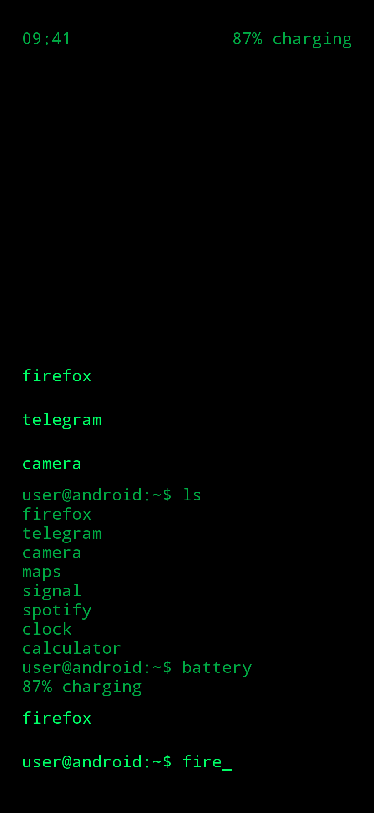
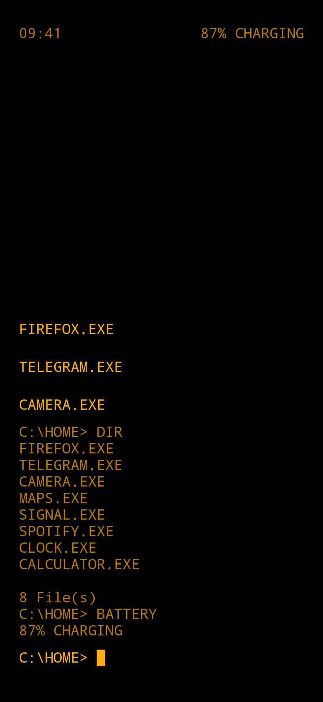
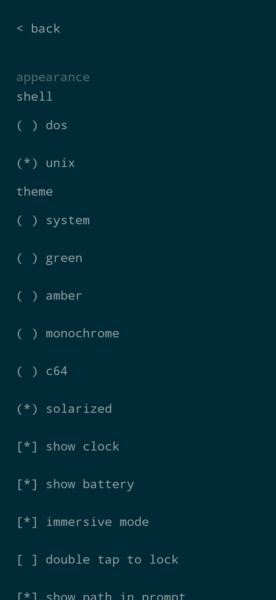

<div align="center">

# Terminal Launcher

**Android reduced to a prompt.**

[](https://github.com/Gybra/Terminal-Launcher/actions/workflows/ci.yml)
[](LICENSE)
[](#build-and-install)
[](https://kotlinlang.org)
[](docs/architecture.md#coverage-policy)





</div>

Terminal Launcher is a minimal, open-source Android Home application written in Kotlin and Jetpack Compose. It presents installed applications as text and launches only Android activities discovered through `PackageManager`. It is a terminal metaphor, not a real shell.

Type a name, press Enter, the application starts. Type a command, it answers under the prompt that asked. Nothing else happens.

## What it does

- **Two shells.** DOS and Unix profiles own prompts, paths, application names, lists, help, command aliases, message style, and the shape of the prompt cursor, so no DOS or Unix branch exists in Compose.
- **Search while you type.** Exact, then prefix, then substring, then fuzzy label matches, at most five at a time, ranked by a documented score. Enter launches only when the query is unambiguous, and every other match stays listed and tappable.
- **Registered commands only.** Every shell alias resolves to a stable command identifier, and anything that is not a command is treated as a search.
- **Six themes.** System, Green, Amber, Monochrome, C64, and Solarized, each of them three colours, over a status line carrying an optional live clock and the battery level.
- **Pins that survive.** Applications and shortcuts kept on Home, including the ones an application asks to pin, such as a browser adding a website.
- **Everything persists.** DataStore keeps every preference, every pin, and how often and how recently each application is launched.
- **Double tap to lock**, the way the power button does, once the user turns on the accessibility service Android requires for it.
- **No shell.** `Runtime.exec`, `ProcessBuilder`, `/bin/sh`, `su`, shell passthrough, and arbitrary Intent URIs are outside the architecture. Read the [safety model](docs/safety.md).
- **Built from the command line**, without Android Studio, with 100% line coverage enforced on every pull request.

Further work is tracked in the [public roadmap](https://github.com/Gybra/Terminal-Launcher/issues).

## Commands

Anything that is not a registered command is treated as a search. Command names are matched without case, and each shell accepts its own aliases:

| What it does | Unix | DOS |
| --- | --- | --- |
| List installed apps | `ls`, `dir` | `DIR` |
| Show available commands | `help` | `HELP` |
| Pin an app to Home | `pin <application>` | `PIN <APPLICATION>` |
| Remove an app from Home | `unpin <application>` | `UNPIN <APPLICATION>` |
| Manage app shortcuts | `shortcuts <application>` | `SHORTCUTS <APPLICATION>` |
| Clear the history | `clear`, `cls`, `clr` | `CLS` |
| Name an app | `alias <name> <application>` | `ALIAS <NAME> <APPLICATION>` |
| Show app details | `info <application>` | `INFO <APPLICATION>` |
| Uninstall an app | `uninstall <application>` | `UNINSTALL <APPLICATION>` |
| Report battery level | `battery` | `BATTERY` |
| Toggle the torch | `torch` | `TORCH` |
| Open Android settings | `android` | `ANDROID` |
| Open Wi-Fi settings | `wifi` | `WIFI` |
| Open Bluetooth settings | `bluetooth` | `BLUETOOTH` |
| Restart the launcher | `restart` | `RESTART` |
| Open launcher settings | `settings` | `SETTINGS` |

How each command behaves, and why, is documented in the [design notes](docs/design.md).

## Build and install

There is no published release yet, so the launcher is built from source. Prerequisites:

- JDK 17;
- Android SDK command-line tools;
- Android SDK Platform 37.0;
- Android SDK Build Tools 36.0.0.

On macOS with Homebrew:

```sh
brew install openjdk@17 android-commandlinetools
export JAVA_HOME="$(brew --prefix openjdk@17)/libexec/openjdk.jdk/Contents/Home"
export ANDROID_HOME="$(brew --prefix)/share/android-commandlinetools"
yes | sdkmanager --licenses
sdkmanager "platform-tools" "platforms;android-37.0" "build-tools;36.0.0"
```

Point Gradle to the SDK using an ignored local file, then build and verify:

```sh
printf 'sdk.dir=%s\n' "$ANDROID_HOME" > local.properties
./gradlew testDebugUnitTest koverVerifyDebug lintDebug assembleDebug
```

Install the APK on a USB-connected device:

```sh
adb install -r app/build/outputs/apk/debug/app-debug.apk
```

## Make Terminal Launcher your Home

Press the Home button once and choose Terminal Launcher when Android asks which Home application to use, or open the Android system settings and change the default Home application there. Android also offers to make the choice permanent; picking "Always" keeps Terminal Launcher as Home until it is changed back in the system settings.

## Documentation

- [Design](docs/design.md): how the launcher is used, and the reason behind every behaviour.
- [Architecture](docs/architecture.md): module boundaries, the flow of state, and the coverage policy.
- [Safety model](docs/safety.md): the one privileged capability the launcher holds, and everything it refuses.
- [Contributing](CONTRIBUTING.md) and [AGENTS.md](AGENTS.md): the rules a change is held to.

## License

Licensed under the [Apache License 2.0](LICENSE).
